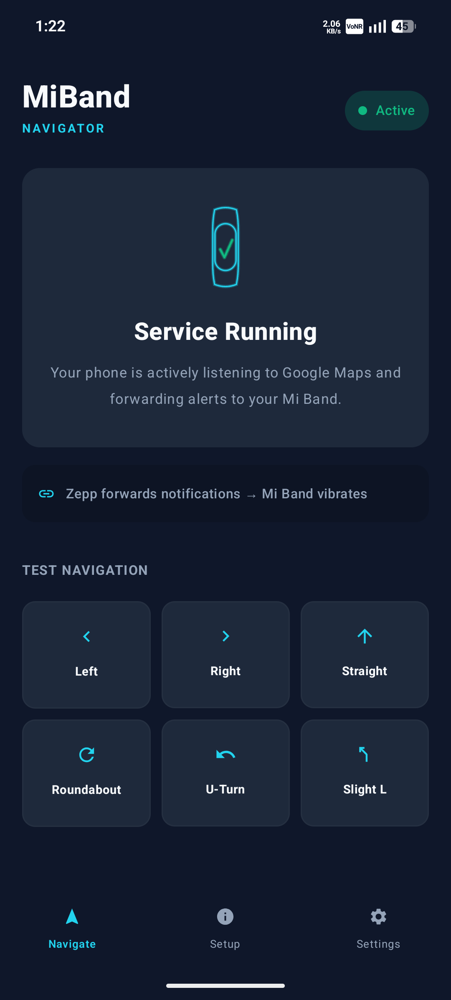
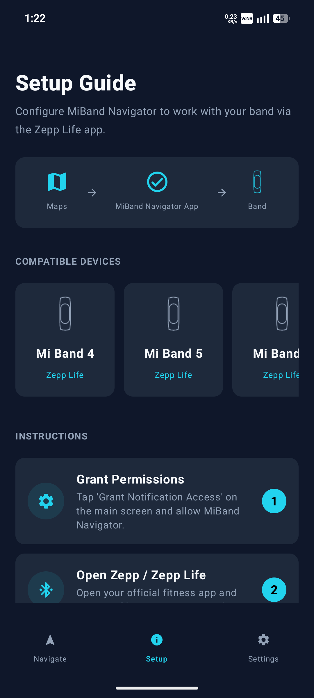
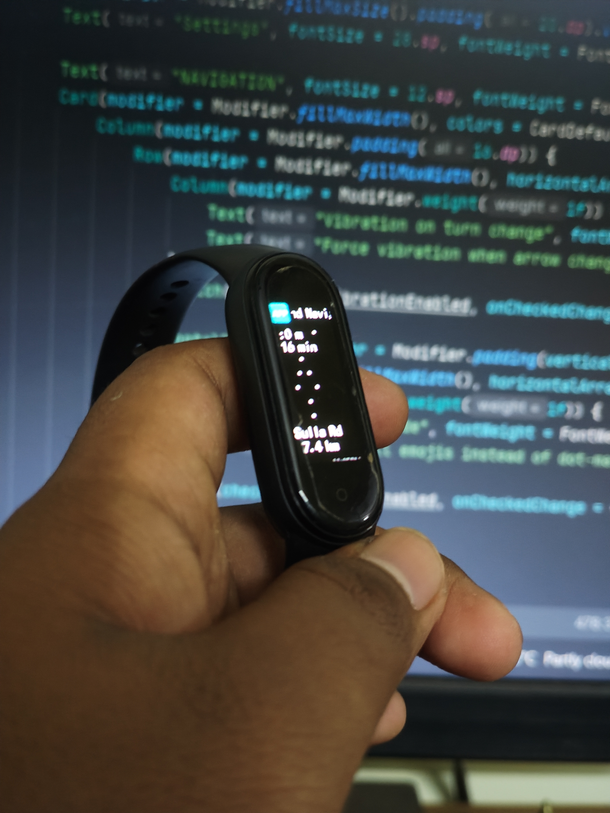

<div align="center">


# 🧭 MiBand Navigator

### Seamless Google Maps turn-by-turn navigation for Xiaomi & Amazfit smart bands

[](https://github.com/satvikpandurangi/MiBandNavigator)
[](https://github.com/satvikpandurangi/MiBandNavigator/releases/tag/v1.0.0)
[](https://github.com/satvikpandurangi/MiBandNavigator)
[](https://github.com/satvikpandurangi/MiBandNavigator/stargazers)
[](https://github.com/satvikpandurangi/MiBandNavigator)

</div>

---

## 📖 Overview

**MiBand Navigator** is a lightweight, background-driven Android application that bridges Google Maps and legacy fitness trackers. Using Android's notification listener service, it intercepts live navigation data from Google Maps, parses it, and reformats it into optimized visual alerts forwarded directly to a Xiaomi Mi Band or Amazfit band through the Zepp ecosystem.

## ❓ Problem Statement

Most legacy smart bands lack native map integration or turn-by-turn navigation support. This is a hardware limitation that MiBand Navigator solves entirely through software: instead of relying on generic, unreadable text notifications, the app parses raw, high-frequency Google Maps notification payloads, extracts distances and directions, and injects custom ASCII arrows or compact emojis before pushing the result to the watch.

## ✨ Features

- **Smart Background Engine** — An optimized `NotificationListenerService` that filters and hijacks Google Maps notification streams without a direct BLE connection or excess battery drain
- **Hardware-Optimized UI Modes**
  - Arrow Animation — animated on-screen arrows for upcoming turns
  - Compact Notifications — shorter text formats for small band screens
  - Visual Progress Bars — real-time distance tracking visualizer
- **UX Throttling** — smart vibration controls to avoid excessive buzzing during rapid map updates
- **Modern Android UI** — Jetpack Compose interface with custom Canvas-drawn icons, live notification previews, and a built-in setup guide

## ⚙️ System Architecture / Workflow

```
Google Maps Notification
        │
        ▼
NotificationListenerService (intercepts & filters)
        │
        ▼
Parser (extracts distance & direction data)
        │
        ▼
Formatter (ASCII arrows / compact text / progress bar)
        │
        ▼
Zepp App (forwards alert via BLE)
        │
        ▼
Mi Band / Amazfit Display
```

**Compatible Devices:** Mi Band 4, 5, 6, 7, 8; future Mi Bands; Amazfit Band Series — all bridged through the Zepp / Zepp Life app.

## 🛠️ Tech Stack

| Layer | Technology |
|-------|------------|
| Language | Kotlin |
| UI Framework | Jetpack Compose (Material Design 3) |
| Graphics | Native Compose Canvas API |
| Architecture | Event-driven background processing with real-time UI state observation |
| Build | Gradle (Kotlin DSL) |

## 📂 Project Structure

```
MiBandNavigator/
├── app/                     # Main Android application module
├── gradle/                  # Gradle wrapper files
├── build.gradle.kts         # Project build configuration
├── settings.gradle.kts      # Gradle settings
├── gradlew / gradlew.bat    # Gradle wrapper scripts
└── MiBand-Navigator-Logo.png
```

## 🚀 Installation

1. Clone the repository:
   ```bash
   git clone https://github.com/satvikpandurangi/MiBandNavigator.git
   ```
2. Open the project in Android Studio.
3. Build and install the app on your Android device via Gradle or Android Studio's Run button.

## 📱 Usage

1. **Install & open Zepp** — ensure it's connected to your band and running in the background.
2. **Enable Notification Access** — go to Settings → Notifications → MiBand Navigator, and allow all notifications.
3. **Configure Zepp Forwarding** — in Zepp → Notification → App Alerts, enable "MiBand Navigator."
4. **Disable Battery Optimization** — for both this app and Zepp, to keep them alive in the background.
5. **Start Navigation** — open Google Maps and begin a route; your band will display turn-by-turn alerts with vibration cues.

## 📸 Screenshots

<table align="center">
  <tr>
    <td align="center">
      <br>
      <b>App Home Screen</b>
    </td>
    <td align="center">
      <br>
      <b>Setup Guide</b>
    </td>
    <td align="center">
      <br>
      <b>Notification Preview</b>
    </td>
  </tr>
</table>

## 🔮 Future Improvements

- Further battery optimization for the `NotificationListenerService`
- Expanded device support, including custom ASCII parsers for newer Mi Band screen sizes
- Code and Canvas-math review/refinement for the Compose UI

## 🤝 Contributing & Forking
This project is 100% open-source. I built this to solve a personal hardware limitation, but there is always room for optimization! 

Whether you want to use this code as a base for your own wearable projects, or you want to help make MiBand Navigator better, you are highly encouraged to fork this repository. 

**Areas where I'd love some help:**
* **Battery Optimization:** Ideas to make the `NotificationListenerService` even more lightweight.
* **Device Support:** Expanding the custom ASCII parsers for different screen sizes (like the newer Mi Band 8/9 standard).
* **Code Review:** If you are an experienced Android dev and see a way to make the Compose UI or Canvas math cleaner, open a Pull Request!

Feel free to open an Issue, submit a Pull Request, or just fork the repo to experiment.

---
> *Engineered by Satvik — Built for the Xiaomi wearable ecosystem.*
